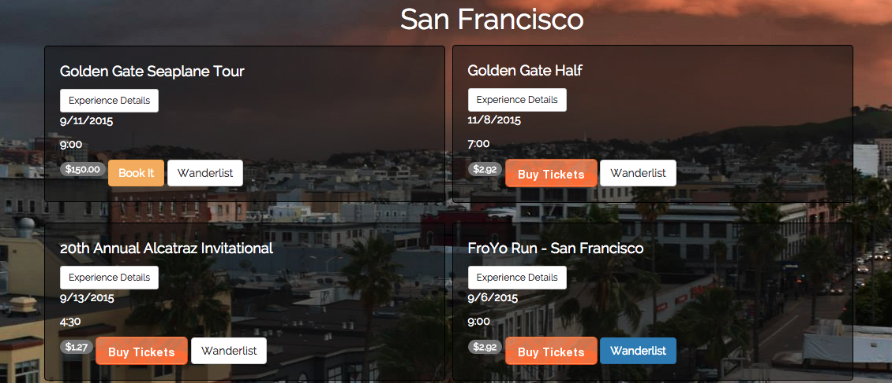

Problem: We track our possessions, our diet, and our exercise regime, but there is no platform that allows us to keep track of the events we attend or the experiences we enjoy. We book tickets, we go, and that's it. What if I wanted to know how much more I was involved in outdoor activities versus food and drink experiences? What if I wanted to collect experiences, not things?

Solution:
Andarography is a web app created by Jessica Anette Lopez. It is a platform for the experience economy and based on the premise that experiences enrich our lives much more than things. Instead of measuring our wellbeing in terms of how much we have, Andarography makes it possible to measure our wellbeing in terms of how much we do. 

Anadrography was inspired by Jessica's research in St. Petersburg, Russia, in 2014. She interviewed 28 local participants and analyzed survey data using STATA regressions to determine if participation in live cultural experiences affected personal health. She found a positive correlation between the two. 

## Table of Contents
* [Technologies Used](#technologiesused)
* [Listed Experiences](#experience)
* [User Profile](#userprofile)
* [Version 2.0](#v2)
* [Author](#author)

## Technologies Used

* Python 
* Flask
* Flask-SQLAlchemy
* jQuery
* AJAX/JSON
* Jinja2
* D3
* Bootstrap
* Eventbrite API

(dependencies are listed in requirements.txt)

Andarography is built on a Flask framework because the microframework, while it does not come with user authentication or an admin interface like Django, is well-designed and flexible. Being able to have more control over the app structure and routing with few predefined requirements was important. 

SQlite was chosen initially because since it makes calls directly to a file holding the data, the SQLite database, it is fast and efficient. Migration to Postgresql was inevitable in order to deploy Andarography, but also necessary because it is a better equipped relational database management system for Andarography, which is meant to be a multi-user application. 

Using SQLAlchemy made the code easy to maintain and create joins easier and more elegantly than in raw SQL (if necessary SQLAlchemy does allow raw SQL). It also allowed access to individual columns in database tables in a pythonic way.

The front-end was built using HTLM, CSS, and Javascript.

## Listed Experiences

After choosing a location users are directed to a page listing experiences and activities offered in the selected city. The experiences come from three sources: Eventbrite, admin, and users. Some events are sourced from Eventbrite using their API and querying by city. Others are seeded into the database by the administrator. The third source is users themselves (see User Profile section).

## User Profile

####D3
When a user books an event, the event information is stored and associated with that user. This information is displayed in the user's profile page using D3, a data visualization Javascript library. This data visualization shows the user what portion of their overall activity is in a certain category. This chart can have various applications: to determine what type of activities the user enjoys the most, to show where she is spending her time and money, and to motivate her to try new experiences in other categories to balance out her visualization (or increase her activity in a certain category, if she so desires).

####New Experience and List Experience Buttons
Each user profile has two buttons: New Experience and List Experience. New Experience allows the user to fill out a form to include in her profile an experience she has had that was not offered on the Andarography experience page. For instance, if she went to a Meditation Retreat, she can add that to her profile and to the data that the visualization reads. Her private experience will appear on her page but will not appear on the public page listing experiences. 

The List experience button makes each user a micro-entrepreneur by allowing her to list an experience that she thinks will be valuable to other users and determine how much she wants to charge. This is great not only for the user listing the experience, but also for other users who can now find experiences in a city that are off the beaten path. It's as if now they have a friend in the city to show them a great time doing things many locals know about and enjoy, but that are difficult for others to discover. 

## Version 2.0
There are various possible next steps for Andarography. The most obvious is to expand it to support other locations. The database structure was designed with this in mind - more locations are very easy to add.  More automated testing is absolutely necessary and should be present in the second version. Testing inputs to the database should be done before completing the migration to postgres and deploying. (NOTE: The app is being deployed, thus migrating from sqlite to postgres is necessary. I've temporarily reverted back to sqlite so that it is possible to run the server locally and play with the app. Using the current database model will not work with postgres because the autoincremented primary keys will cause Integrity errors with null values when the user submits a form.)

A feature that would add to the user experience would be a customized experience page implemented using a machine learning algorithm. Once the user books or saves an event, the app could recommend more experiences near that event on the same date. This feature would help users optimize their time in a location. Adding category filters would help the user 'silence' events in which they have no interest, and help her achieve any goals she set for participation in events in a certain category. 

Adding a payment processing system is also necessary. In the current version, there is no way to determine if once the user is directed to the Eventbrite page for the event she actually purchases the tickets. Additionally, if the user books either the events generated by other users or by the admin, there is no action feedback. The event is simply entered into the booked table in the database along with the id of the user in the session. The user can then view the title of the event under the 'booked' tab in the user page. Adding a payment system would allow each user (or the admin)  to make money from the experiences she is listing on Andarography. Also, adding a feature to purchase Eventbrite tickets in-app would allow payment verification before the event is added to the user's booked events. A small payment processing system can be built using a flask framework and integrating with Stripe or Braintree. I've started this project recently and it's in another repo.

## Author
Jessica Anette Lopez is a software engineer in San Francisco, CA.
wwww.linkedin.com/in/jessicaalopez
